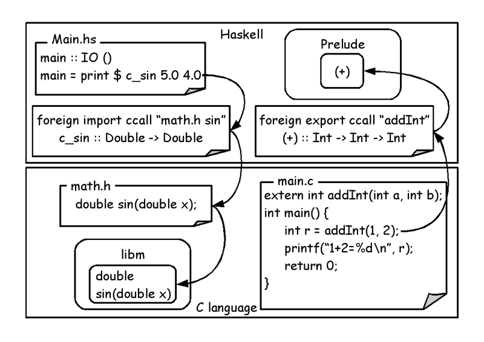

# call_function

## Definition

C language function is called by Haskell language.
Or Haskell language function is called by C language.

## Motivation

Isolate C and Haskell by using function interface.
Can't snatch C language logic on the snatch stage.

## Structure

## Example

[source code](../../src/call_function)
